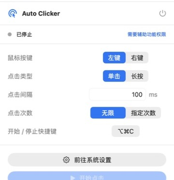
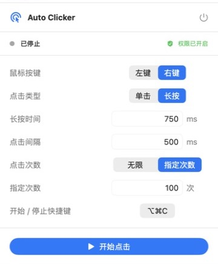

# Auto Clicker for macOS

Auto Clicker 是一款原生 SwiftUI 菜单栏连点工具。它在每次操作前读取鼠标当前位置，点击会跟随鼠标移动，并按照配置持续发送鼠标事件，不需要坐标输入、脚本、账号或网络服务。

## 界面预览

<p align="center">
  
</p>

控制面板集中展示权限、鼠标按键、点击类型、间隔、次数和全局快捷键。应用窗口关闭后仍会驻留菜单栏，需要时可从菜单栏指针图标重新打开。

## 功能

- 左键或右键
- 单击或长按
- `10～60000 ms` 点击间隔
- 无限点击或指定点击次数
- 点击位置实时跟随鼠标移动
- 全局快捷键开始/停止，默认 `⌥⌘C`
- 辅助功能权限检测与系统设置入口
- 本地保存配置
- 控制窗口与菜单栏 Popover
- 停止或退出时可靠终止任务

产品范围及验收标准见 [Auto_Clicker_PRD_v1.1.md](Auto_Clicker_PRD_v1.1.md)。

## 系统要求

- macOS 13 Ventura 或更高版本
- Apple Silicon 或 Intel Mac；构建结果使用当前 Mac 的处理器架构
- 开发时需要 Xcode，或与本机 macOS SDK 匹配的 Swift Command Line Tools

项目没有第三方依赖，也不会访问网络。

## 下载与使用

### 1. 下载并打开

前往 [Releases](https://github.com/pikachuprogrammer01/auto-clicker-mac/releases/latest)，按芯片架构下载对应安装包：Apple Silicon 使用 `arm64`，Intel Mac 使用 `intel`。例如 v1.1.0 的 Intel 包为 `Auto-Clicker-v1.1.0-intel.zip`。解压后双击 `Auto Clicker.app`，应用会打开控制窗口并在菜单栏显示指针图标。

Intel 安装包由 GitHub Actions 的 `macos-13` Intel runner 构建；每个 ZIP 都附带同名 `.sha256` 校验文件。

### 2. 授予辅助功能权限

首次启动时，按系统提示打开“系统设置 → 隐私与安全性 → 辅助功能”，允许 Auto Clicker。返回应用后，右上角显示绿色“权限已开启”即表示可以发送鼠标事件；未授权时应用会禁用启动操作并提供“前往系统设置”按钮。

<p align="center">
  
</p>

### 3. 配置点击任务

<p align="center">
  
</p>

示例截图配置了右键长按 750ms、每次操作后等待 500ms，并在完成 100 次后自动停止。各项含义如下：

- **鼠标按键**：选择左键或右键。
- **点击类型**：单击会连续发送 `mouseDown` 和 `mouseUp`；长按会在两者之间保持指定时间。
- **点击间隔**：一次操作完成后到下一次操作开始前的等待时间，范围为 `10～60000 ms`。
- **点击次数**：无限模式持续运行到手动停止；指定次数完成后自动停止。

### 4. 修改全局快捷键（可选）

<p align="center">
  
</p>

点击当前快捷键后，按钮会显示“请按新组合键”。按下包含 `⌘`、`⌥` 或 `⌃` 的组合键即可保存；按 `Esc` 取消。若组合键被其他应用占用，Auto Clicker 会恢复旧快捷键并提示重新设置。

### 5. 开始并跟随鼠标

按全局快捷键开始任务，默认是 `⌥⌘C`。应用会在每次操作前读取鼠标当前位置；运行期间移动鼠标，后续点击会自动跟随到新的位置。

运行界面会显示已完成次数、鼠标跟随状态、当前鼠标操作和停止快捷键。再次按同一快捷键，或点击红色“停止点击”按钮，即可立即停止任务。

关闭控制窗口不会退出应用。需要完全退出时，点击面板右上角的电源按钮；应用会先停止当前任务，再结束进程。

## 开发

直接运行 Swift Package：

```sh
swift run AutoClicker
```

生成可双击的 `.app`：

```sh
./scripts/build-app.sh
```

产物位于 `dist/Auto Clicker.app`。脚本执行 Release 构建、组装 Bundle，并使用 ad-hoc 签名供本机开发测试。

运行核心检查：

```sh
./scripts/run-checks.sh
```

检查覆盖：

- 输入范围与非法值
- 指定次数的事件数量和顺序
- 鼠标从 X1 移动到 X2 后，后续点击跟随到 X2
- 长按中途停止时立即唤醒并补发 `mouseUp`

## 项目结构

```text
Sources/AutoClicker/        应用、UI、快捷键、权限、配置与点击引擎
Checks/                     不发送真实鼠标事件的核心检查
Support/Info.plist          App Bundle 元数据
scripts/build-app.sh        Release 构建及 Bundle 组装
scripts/run-checks.sh       核心逻辑检查入口
.github/workflows/          GitHub Actions 构建与发布流程
docs/ARCHITECTURE.md        架构与线程模型
docs/RELEASE.md             签名、公证与发布流程
docs/images/                README 使用流程截图
Auto_Clicker_PRD_v1.1.md    产品需求与验收标准
LICENSE                     MIT 许可证与免责声明
```

## 权限与隐私

辅助功能权限仅用于通过 `CGEvent` 发送鼠标事件。应用不包含网络请求、统计 SDK、账号系统或数据库；偏好配置保存在 macOS `UserDefaults` 中。

如果授权后仍显示“需要辅助功能权限”，请退出应用，在辅助功能列表中移除旧条目，重新打开当前构建的 App 后再次授权。开发阶段重新构建 ad-hoc 签名版本时，macOS 可能要求重新确认权限。

## 文档

- [架构说明](docs/ARCHITECTURE.md)
- [构建与发布](docs/RELEASE.md)
- [产品需求](Auto_Clicker_PRD_v1.1.md)

## 当前边界

MVP 不提供固定坐标、多位置、轨迹录制、键盘宏、脚本、定时任务、OCR、云同步或服务端能力。

## 许可证与免责声明

本项目使用 [MIT License](LICENSE)。软件按“现状”提供，不附带任何明示或默示保证；在适用法律允许的最大范围内，作者或版权持有人不对因软件或软件使用产生的任何索赔、损害或其他责任负责。完整且具有约束力的条款以 `LICENSE` 英文原文为准。
